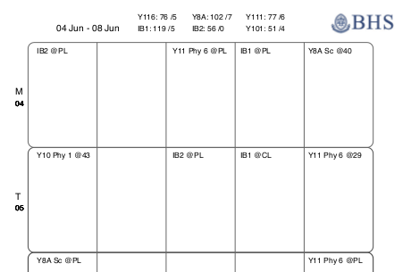
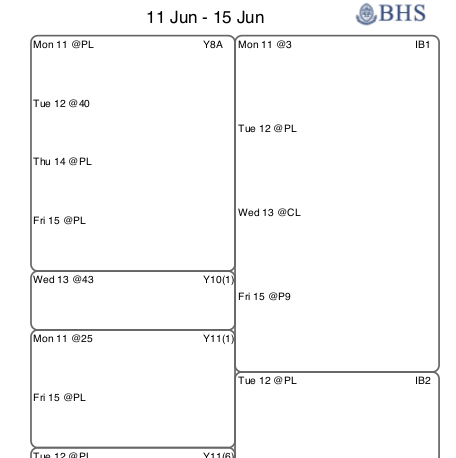

# This program generates a calendar and a planer for the 6-day BHS Calendar

- It creates an **.ics** file to import a 6-day calendar to google calendar / icalendar.

- It creates a printable **PDF** file containing a planner for the whole year.
Weekly Calendar: 
Weekly Planer: 

- It generates statistics like:  "This Monday you have 52 lessons of IB left until the end of the Year"

# Dependencies

To run the script you will need the python [icalendar](http://icalendar.readthedocs.org/) Package.
To generate the PDF you will also need [reportlab](https://bitbucket.org/rptlab/reportlab) Package.

# How it works

The public holidays, breaks, training days, etc ... are stored in a csv file called [dates_and_breaks.csv](./new-bhs-cal/dates_n_breaks.csv).  Each day is split in 5 periods, and the starting time of each period is declared in [schedule_times.py](./new-bhs-cal/schedule_times.py) 
Each teacher / student then needs to create an excel file with their timetable and save it with the following format: [timetable_files/timetable.csv](timetable_files/timetable.csv). 

To describe the classroom or location of our class, we will use an `@` symbol.  So for example teaching physics in the physics lab will be recorded as:  `Phys Y11 @PhysicsLab`  (Note that the location needs to have no spaces.  So "`@PL`", `@ChemLab` or "`@34`" are acceptable, but "`room 34`" is not.)

[`newcal.py`](new-bhs-cal/newcal.py) will import the breaks and holidays, the schedules and the specific timetable.  It will then create a list of all the days
from the first day of school to the last and exclude `breaks + public_holidays + staff_induction + staff_prof_development + last_day_of_school`).  This leaves the variable `d_o_t` (*day of teaching*) only with the days when there are actual lessons.

# Ideas

Possible improvements:

- The PDF generator called [`sandbox.py`](new-bhs-cal/sandbox.py) needs to be refactored and generalized.  It currently has too many hard-coded variables specific to my calendar.
- Create a web interface for other teachers to upload their timetable and download the icalendar + planer.

